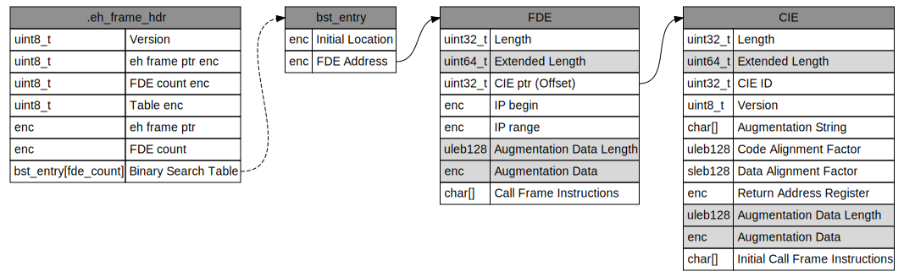
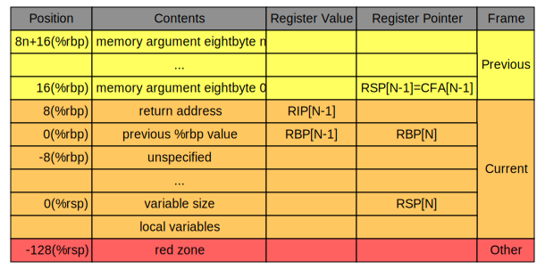

# Exception

## Unwind library

The compiler will generate the eh_frame elf file section which contains a description of how to unwind the stack. Following the recorded instructions will allow the unwinding library to restore the register state to the one right before the current method was called.

The first step is to find the the Frame Description Entry for the current Instructioon Pointer (IP). It should be contains between two inital location from the Binary Search Table of the Exception Handler Frame Header (eh_frame_hdr) for the current DLL/EXE.

Once we get the corresponding FDE (with it's parent CIE), the unwind library will first call the personality routine (if it exist).

If the personality routine was not found or if it couldn't handle the exception, the unwind library will decode the Initial Call Frame Instructiona (in the CIE) then the Call Frame Instructions (in the FDE). This describes the mathematical operation to apply to the current register state to generate the caller's one.

The main register to restore are:
- RSP: current stack pointer
- RBP: usually contains the previous stack base pointer
- RIP: the return adress to the caller
- R12-15: if the callee modified those register

This cycle continue until either a personality routine that can handle the excpetion is found or no FDE is found for the current unwinded stack frame (we probably reach the start of the prgoram). In the latter case, we terminate the program.

## Personality routine

Every language can provide it's implementation of the personality routine. It contains the language specifics instruction for the program to know how to handle the exception. 

Language supported:
- [C++](exception_cpp.md)
