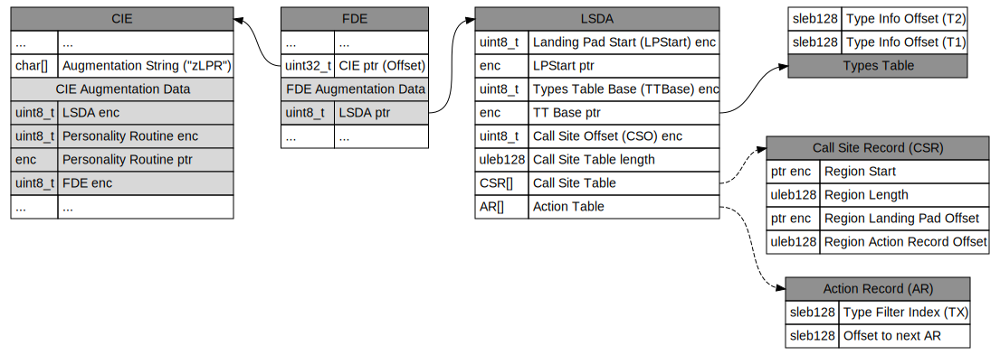

# C++ Exception Handling

## Overview

C++ exception handling is managed through the C++ personality routine called by the unwind library when unwinding C++ code.

This function checks the following elements:
- There is a special processing to do to handle the current exception based on it's type (e.g. catch)
- There is a special cleanup to call (e.g. callling the destructor for local variables)

The compiler translates a C++ function into a few sections:
- The regular path (like it didn't have any exception handling)
- The landing pad that contains the code for:
    - The selection of the catch block to execute based on the exception type.
    - The exception handling itself for each type supported.
    - The eventual cleanup of local variable before resuming the current exception unwinding.


```c++
void function() {
    // Bloc 1
    std::string str1 = "test";
    try {
        // Bloc 2
        fn_throw_int(); // This function throws an int
    } catch (int i) {
        // Bloc 3
        // Handle int exception
        printf(i);
    } 
}
```

```c++
void function() {
#region Golden Path
bloc_1:
    allocate_str1();

bloc_2_try:
    fn_throw_int();

function_cleanup:
    deallocate_str1();
    return;
    // Unreachable

#region Landing Pad
bloc_3_catch:
    switch(exception type) {
    case int:
        goto bloc_3_catch_int;
    default:
        goto bloc_3_catch_cleanup;
    }

bloc_3_catch_int:
    // Handle int exception
    printf(i);
    goto function_cleanup;

bloc_3_catch_cleanup:
    deallocate_str1();
    _Unwind_Resume();
    // Unreachable
}
```

## Exception Handling tables

A pointer to the personality routine is stored in the CIE. The description of the different section and how to call them based on the exception is based on the Language Specific Data Area content (a pointer to it is stored in the function FDE). 



The personality routine executes the following steps:
- Find the call site record associated with the current RIP to find which Landing Pad to call (there can be multiple landing pad in the same function in case there are multiple try/catch).
- Recursively check the Action Record for the call site record to see if the current exception type is handle. The Action Record contains:
    - An index into the Types Table.
    - An offset to next Action Record (when their are multiple catch with different types).
- Ask the unwind library to transfer control to the Landing pad with the Type Table index as parameter (this is used in the Landing Pad switch to call the right exception handling code.)

Note:
There could be a Landing pad without try/catch. The Landing Pad will catch any exception and clean up any local variables before resuming the exception.

## C++ generated code for exception handling (details)

### Handle multiple exception type and clean up local variables

```c++
void function() {
    // Bloc 1
    std::string str1 = "test1"
    try {
        // Bloc 2
        std::string str2 = "test2"
        if (a) {
            throw exc;
        }
    } catch (int i) {
        // Bloc 3.1
        // Handle int exception
    } catch (bool b) {
        // Bloc 3.2
        // Handle bool exception
    } catch (std::string s) {
        // Bloc 3.3
        // Handle string exception
    }
    // Bloc 4
    std::string str3 = "test3"
}
```

```c++
void function() {
bloc_1:
    allocate_str1();

bloc_2_try:
    allocate_str2();
    if (a) {
        __cxa_allocate_exception(int:10);
        __cxa_throw();
        // Unreachable
    }
    deallocate_str2();

bloc_4:
    allocate_str3();

function_cleanup:
    deallocate_str3();
    deallocate_str1();
    return;
    // Unreachable

bloc_2_catch:
    switch(exception type) {
    case int:
        goto bloc_2_catch_int;
    case bool:
        goto bloc_2_catch_bool;
    case std::string:
        goto bloc_2_catch_string;
    default:
        goto bloc_2_cleanup_resume_exception
    }
bloc_3_1:
bloc_2_catch_int:
    // Handle int exception
bloc_3_2:
bloc_2_catch_bool:
    // Handle bool exception
bloc_3_3:
bloc_2_catch_string:
    // Handle string exception

bloc_4_catch:
bloc_4_cleanup_resume_exception:
    deallocate_str3();
bloc_3_1_catch:
bloc_3_2_catch:
bloc_3_3_catch:
bloc_2_cleanup_resume_exception:
    deallocate_str2();
bloc_1_catch:
bloc_1_cleanup_resume_exception;
    deallocate_str1();
    _Unwind_Resume();
    // Unreachable
}

```

### Handle exception (details)

```c++
void function() {
    // Rethrow
    try {
        throw 10
    } catch(int a) {
        // Handle exception
    }
}
```

```c++
bloc_catch_int:
    __cxa_begin_catch();
    // Handle exception
    __cxa_end_catch(); => __cxa_free_exception(int);
```

### Rethrow exception (details)
```c++
void function() {
    // Rethrow
    try {
        throw 10;
    } catch(int a) {
        // Handle exception
        throw;
    }
}
```

```c++
bloc_catch_int:
    __cxa_begin_catch();
    // Handle exception
    __cxa_rethrow();
    __cxa_end_catch();
    _Unwind_Resume();
```

### Throw a new exception (details)

```c++
void function() {
    try {
        throw 10
    } catch(int a) {
        // Handle exception
        throw false;
    }
}
```

```c++
bloc_catch_int:
    __cxa_begin_catch();
    // Handle exception
    __cxa_allocate_exception(bool:false);
    __cxa_end_catch() => __cxa_free_exception(int);
    __cxa_throw();
```

